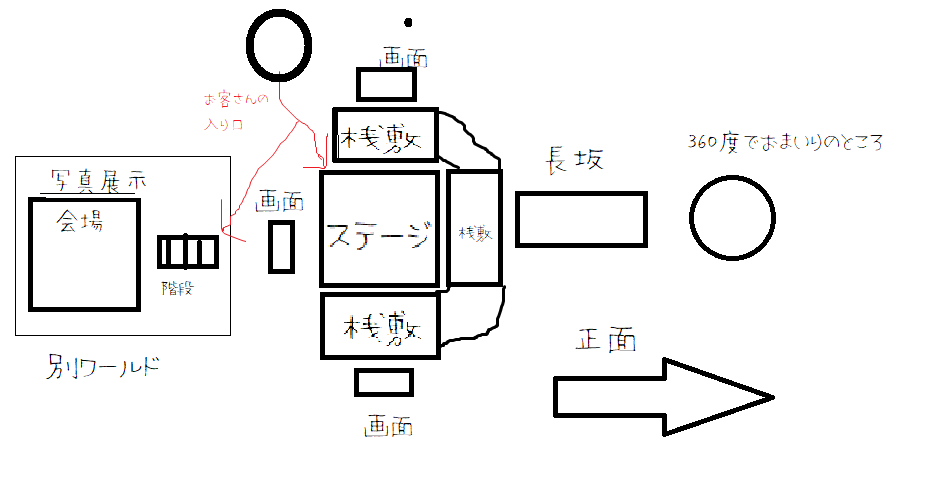

# 5.15-議事録

## チャトラの妄想

1. 大型ディスプレイでおくんち動画上映  
1. ステージでライブ配信（3日間）  
1. YouTubeライブのチャット表示  
1. しゃぎりのBGM  
1. おくんち写真展（募集）  
1. 映えスポット（モニュメント？）  
1. おくんちの歴史など掲示  
1. おくんち関連企業紹介掲示  
1. 長崎の取り組み紹介（長崎の変など）  

- 長崎の企業の紹介？  
  ご飯とか

## CHEBLO

- リアルとのからみ（リアル会場）
  - コラボしたいな
    - 県，市
    - NBC
  - ライブビューイング
    - youtubeからの配信を流しておく
    - 会場
      - セントラルシアター
      - ハマクロス
      - 県庁（一階のプロジェクター）
    - 実機を置いておいて体験してもらう
      - 遊イングからの提供も？

  - 写真展等

  - 懸念点
    - そもそも中止になったくんち
      - コロナのせいだけではないので，そっちからにらまれないか？
      - 爆弾を踏まないように...
    - つながりがNIBなので，怒られる？
    - 個人もちの資料があまりない

## 使い方
- 当日はステージ演出
- 終わった後の交流の場所にも

## バーチャル会場

  - 
  - 桟敷がメイン
  - 四方に画面
  - お参りのところは360度画像で
  - 階段を下ると写真展
  - フォトスポット
  - 投稿で抽選するとお土産？
    - Twitterのハッシュタグとかで追う
    - clusterには確認する必要がありそう  
  - 桟敷の下にVグループの紹介
    - vrmおいててきとうにアニメーションさせとく
      - 背景に写真
        - とりたい人によって背景を変えたりとか
    - パネル
  - さくらのようい？
  - BGMにしゃぎり

- もってこいの声掛けをしてほしい時に拡声器？的なギミックがあると
- 反応するときのギミックができるように

- あったらいいなのもの
  - カステラブロック
  - よりよりの剣
  - ねこ...

- 展示について
  - 会場についてはいい感じにしたい
    - 要検討
  - パネル的な
  - モニュメントとバエスポット
    - 作りたいものがあればモデリング
    - フォトグラメリ
    - パネル
  - かかわった人のブース？
    - 長崎の変

### 中のイベントについて
- マルバツクイズ
- コア時間をつくる
- 有名人を呼ぶ
  - 市長
  - きよちゃんぽん

## これからやっていくこと

- 先に覇権をとる必要がありそう
  - とりあえず告知
- とりあえず見せられるような会場作り
  - モデリングは後回し
- 環境デザインをCHEBLOに聞いてみる
  - かブース制作
